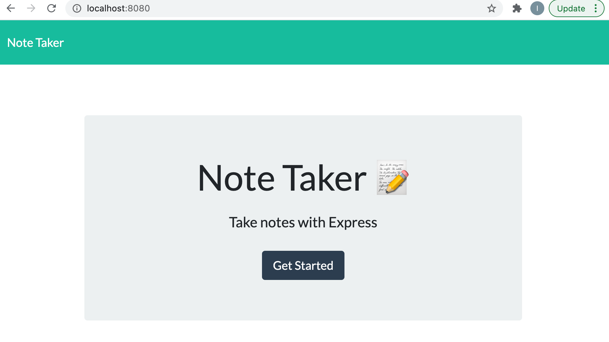
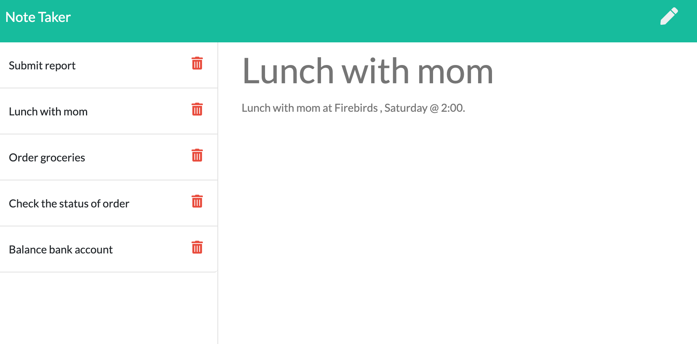

# Express Notetaker

[Walkthrough Video](https://drive.google.com/file/d/11RnHljIv0bC-5YkxRITstGY-KazG1iGQ/view)
    
[Heroku Link](https://expressnotetaker0224.herokuapp.com/)

## Description

   
---
When I open the Note Taker I am presented with a landing page with a link to a note page. When I click the link to the note page then I am presented with a page with existing notes listed in the left column. When I enter a new note title and note text then a save icon appears in the navigation at the top of the page. 
    

## Table of Contents 
     
---
* [Installation](#Installation)
* [UserStory](#UserStory)
* [Usage](#Usage)
* [Credits](#Credits)
* [License](#License)
* [Badges](#Badges)
* [Questions](#Questions|Comments|Concerns)
    
---
## Installation

User must first have node installed on their device. Next the user will need to do "npm i  express" -> "npm i nodemon" -> "npm i uuid".

---

## UserStory

As a small business owner I want to be able to write and save notes , so that I can organize my thoughts and keep track of task that I need to complete.

---

## Usage 

This project can be used by anybody. It is good for all audiences, from personal to business.

---

## Credits 

NO collaborators.

---

## License

---

## Badges 

---

## Questions|Comments|Concerns

https://github.com/imanid-code

imanidillahunt@gmail.com
---
